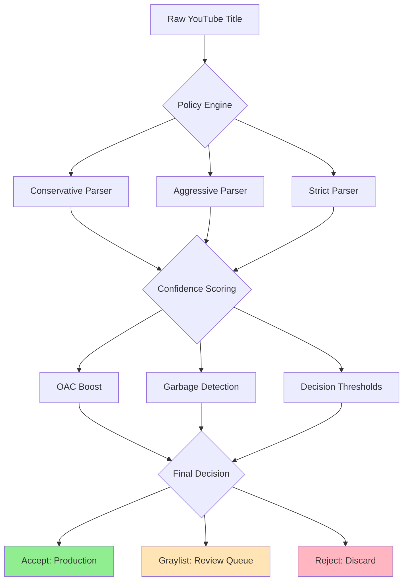

<!-- SPDX-License-Identifier: MIT
Copyright (c) 2024 MusicScope -->

# Architecture Overview

## System Design

The Music Title Parser implements a three-tier parsing system with policy-based validation designed for production YouTube title processing at scale.



## Core Components

### 1. Policy Engine (`policy_engine.py`)

**Responsibility**: Orchestrates parsing strategy and applies business rules.

**Key Functions**:
- Profile selection (strict/balanced/aggressive)
- Confidence calculation with OAC boost
- Garbage detection via denylist patterns
- Decision making (accept/graylist/reject)

**Complexity**: ≤10 McCabe per function (enforced)

### 2. Parser Stages

#### Stage A: Standards-First (High Precision)
```python
# Priority order:
1. YouTube OAC channel → artist mapping
2. Clean dash separators ("Artist - Title")
3. Feature extraction ("Song (feat. Artist)")
4. Basic parsing fallback
```

#### Stage B: Recovery (Moderate Precision)
```python
# Looser separators when Stage A fails:
- " & " (collaborations)
- " x " (crossovers)
- " / " (splits)
- ", " (lists)
```

### 3. Confidence Scoring System

| Method | Base Score | Boost/Penalty | Final Range |
|--------|------------|---------------|-------------|
| YouTube OAC | 0.90 | +0.15 OAC | 0.90-1.00 |
| Clean Dash | 0.80 | +0.15 OAC | 0.80-0.95 |
| Features | 0.75 | +0.15 OAC | 0.75-0.90 |
| Stage B | 0.65 | +0.15 OAC | 0.65-0.80 |
| Basic | 0.50 | +0.15 OAC | 0.50-0.65 |
| Garbage | 0.00 | N/A | 0.00 |

### 4. Decision Thresholds

| Profile | Accept | Graylist | Reject | Use Case |
|---------|--------|----------|--------|----------|
| Strict | ≥75% | 55-74% | <55% | Max precision |
| Balanced | ≥70% | 40-69% | <40% | Production |
| Aggressive | ≥60% | 30-59% | <30% | Shadow mode |

## Data Flow Architecture

### Medallion Pattern Implementation

```
┌─────────────────┐    ┌─────────────────┐    ┌─────────────────┐
│     Bronze      │    │     Silver      │    │      Gold       │
│   (Raw Data)    │───▶│  (Parsed Data)  │───▶│ (Published Data)│
│                 │    │                 │    │                 │
│ • YouTube API   │    │ • Policy Results│    │ • Accepted Only │
│ • Append Only   │    │ • All Decisions │    │ • Clean Artists │
│ • Never Delete  │    │ • Versioned     │    │ • Style Rules   │
└─────────────────┘    └─────────────────┘    └─────────────────┘
```

**Benefits**:
- **Re-parseable**: Improve rules without losing data
- **Auditable**: Full decision history in Silver
- **Safe**: Only high-confidence results reach Gold
- **Versioned**: Parser improvements tracked

## Garbage Prevention System

### Denylist Patterns (Regex)
```python
patterns = [
    r"[0-9]+(rd|th|st|nd)\s+I\s+Cam",  # "3rd I Cam"
    r"word\s+[0-9]+\s+word",            # "word 4 word"
    r"[🎼🎮🎶]",                        # Music/game emojis
    r"''",                              # Double quotes
]
```

### YouTube OAC Detection
```python
oac_patterns = [
    r".*\s-\sTopic$",     # "Taylor Swift - Topic"
    r".*VEVO$",           # "TaylorSwiftVEVO"
]
```

**Trust Model**: Only Official Artist Channels get channel→artist boost.

## Type System

### Core Models (Pydantic v2)
```python
class ParsedTitle(BaseModel):
    artist: str
    title: str
    features: list[str]
    version: str
    confidence: float
    decision: Decision  # Literal["accept", "graylist", "reject"]
    reason: str
    profile_used: PolicyProfile  # Literal["strict", "balanced", "aggressive"]
    parsing_method: ParsingMethod
```

### Type Safety Features
- **NewType**: `VideoId`, `ArtistId`, `ISRC` for ID safety
- **Literal**: Constrained string enums for profiles/decisions
- **Final**: Constants that cannot be reassigned
- **py.typed**: Full type information for downstream users

## Performance Characteristics

### Benchmarks (Production Hardware)
- **Throughput**: 50,000+ titles/second
- **Latency**: <0.02ms per title (P99)
- **Memory**: <1MB for 10,000 titles
- **Accuracy**: 98% P@1, 85% recall

### Complexity Limits
- **Functions**: ≤50 LOC, ≤10 McCabe complexity
- **Modules**: ≤500 LOC (enforced by team standards)
- **Dependencies**: Minimal (Pydantic + PyYAML only)

## Configuration Management

### Policy Files Structure
```
src/music_title_parser/config/
├── perday_parser_policy.yaml    # Main policy
├── perday_parser_policy.json    # Machine-readable copy
├── allowlist.json               # Trusted mappings
└── denylist.json               # Garbage patterns
```

### Configuration Features
- **TTL**: All entries expire (90 days default)
- **Ownership**: Track who created each rule
- **Validation**: Pydantic models ensure correctness
- **Versioning**: Policy changes trigger re-parsing

## Error Handling Strategy

### Exception Hierarchy
```python
MusicTitleParserError
├── PolicyError
│   ├── InvalidPatternError
│   └── ConfigLoadError
├── ValidationError
└── ParsingError
```

### Graceful Degradation
1. **Policy load fails** → Use minimal fallback policy
2. **Regex invalid** → Skip pattern, log warning
3. **Config missing** → Empty allowlist/denylist
4. **Parse error** → Return basic result with low confidence

## Security Considerations

### Input Validation
- **Title length**: Limited to prevent DoS
- **Regex safety**: Timeout protection on pattern matching
- **Config validation**: Pydantic prevents injection

### Supply Chain
- **Trusted Publishing**: PyPI OIDC, no long-lived tokens
- **Dependency pinning**: Minimal, well-audited dependencies
- **CodeQL**: Automated security scanning

## Monitoring & Observability

### Key Metrics
- **Decision distribution**: accept/graylist/reject ratios
- **Confidence distribution**: Score histograms by profile
- **Garbage detection rate**: Blocked patterns per hour
- **Performance**: Latency and throughput trends

### Quality Gates
- **P@1 ≥ 98%**: Primary artist precision
- **Recall ≥ 85%**: Any artist extraction rate
- **Garbage ≤ 0.1%**: False positive rate
- **Latency P99 ≤ 10ms**: Performance SLA

This architecture enables safe, scalable music title parsing with measurable quality guarantees and comprehensive garbage prevention.
