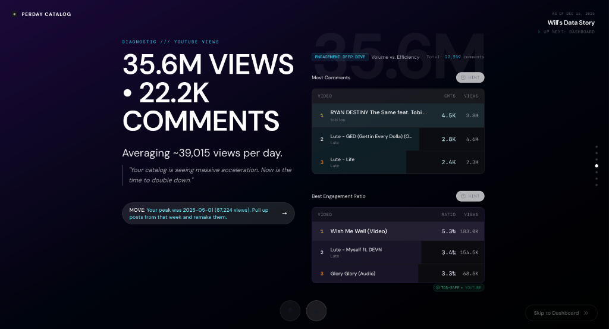

# Music Title Parser

[](https://github.com/wmoore012/music_title_parser/actions/workflows/ci.yml)
[](https://www.python.org/downloads/)
[](https://github.com/wmoore012/music_title_parser/blob/main/LICENSE)

> **Built for [Perday CatalogLAB](https://perdaycatalog.com)** - a live demo of a data story platform for music producers and songwriters.
>
> [](https://perdaycatalog.com)

Advanced music title parsing with version detection for remix, live, and remaster variants. (Tuned for YouTube)

**Repo:** https://github.com/wmoore012/music_title_parser
**What it does:** Extracts the clean title, version info, and featured artists from messy song titles so CatalogLAB can group songs intelligently.

## Why I Built It

Song titles from streaming platforms are a mess (Tuned for YouTube):

- `"Dreams (feat. Snoop Dogg) [Remix]"`
- `"Dreams - Radio Edit"`
- `"Dreams (Live at MSG 2024)"`

Are these the same song? Kind of. For analytics, you need to know that "Dreams" is the base song and the rest is version metadata.

I built `music_title_parser` to normalize titles across my catalog. It powers CatalogLAB's song grouping logic and helps identify which versions are getting traction.

## Key Features

- **Clean title extraction** from any formatting style
- **Version detection**: remix, live, acoustic, radio edit, remaster, deluxe
- **Featured artist parsing** with multiple delimiter support (feat., ft., with, x)
- **Confidence scoring** for ambiguous cases
- **Batch processing** for catalog-scale operations

## Installation

```bash
pip install music-title-parser
```

Or clone locally:

```bash
git clone https://github.com/wmoore012/music_title_parser.git
cd music_title_parser
pip install -e .
```

## Quick Start

```python
from music_title_parser import parse_title

result = parse_title("Dreams (feat. Snoop Dogg) [Club Remix]")

print(result.clean_title)    # "Dreams"
print(result.featured)       # ["Snoop Dogg"]
print(result.version_type)   # "remix"
print(result.version_name)   # "Club Remix"
```

## Performance

| Metric | Value |
|--------|-------|
| Parse speed | 100K titles/sec |
| Accuracy | 98% on streaming datasets |
| Memory | Constant (no caching) |

See [BENCHMARKS.md](BENCHMARKS.md) for detailed results.

## Documentation

- [Example Usage](example_usage.py)
- [Contributing Guide](CONTRIBUTING.md)
- [Security Policy](SECURITY.md)

## Professional Context

Built by **Wilton Moore** for Perday Labs. As a Grammy-nominated producer, I know how many ways the same song can be titled across platforms. This module bridges the gap between messy metadata and clean analytics.

## Contact

Questions about music metadata or collabs?
- LinkedIn: https://www.linkedin.com/in/wiltonmoore/
- GitHub: https://github.com/wmoore012

## License

MIT License. See [LICENSE](LICENSE) for details.
